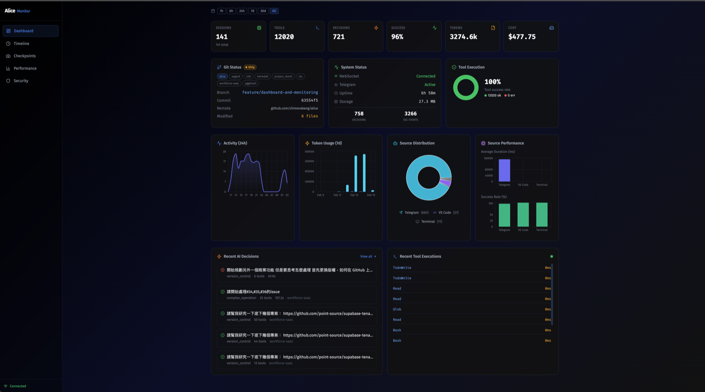
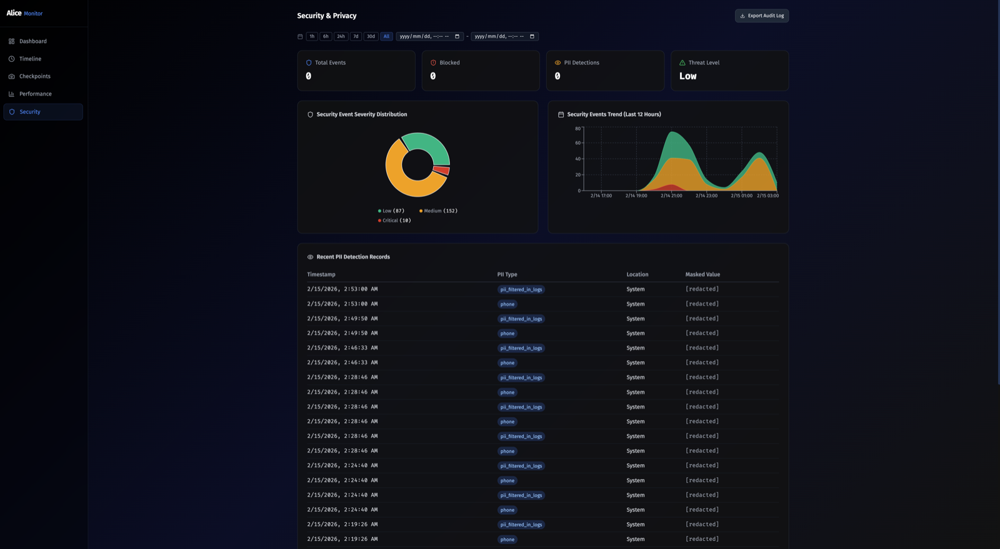
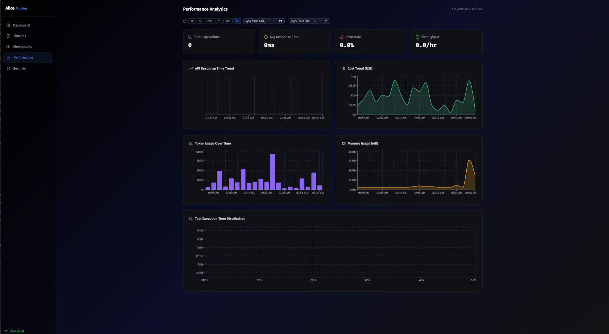
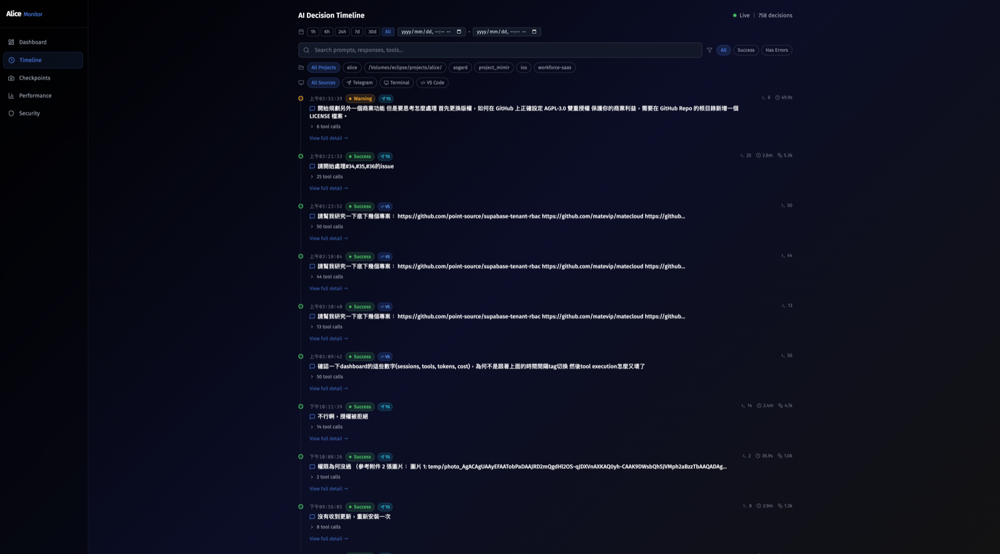

<p align="center">
  <h1 align="center">👁️ Alice Monitor</h1>
  <p align="center"><strong>The Local-First AI Agent Observability & Security Platform.</strong></p>
  <p align="center">Stop debugging your LLM agents with <code>print()</code>. Visualize reasoning, track API costs, and catch security leaks in real-time.</p>
</p>

<p align="center">
  <a href="#-why-alice-monitor">Why?</a> &bull;
  <a href="#-key-features">Features</a> &bull;
  <a href="#-oss-maintainer-workflows">OSS Maintainers</a> &bull;
  <a href="#-quick-start">Quick Start</a> &bull;
  <a href="#-tech-stack">Tech Stack</a> &bull;
  <a href="#-community--support">Community</a> &bull;
  <a href="#-license">License</a>
</p>

---

## 🚀 Why Alice Monitor?

As AI agents move from experimental scripts to production systems, terminal logs are no longer enough. Alice Monitor acts as the **flight data recorder** for your AI agents.

Built entirely in **Go**, it ships as a single, lightweight binary with a gorgeous **OLED dark-mode dashboard**. It's designed specifically for developers who care about **data privacy**, **cost control**, and **deep observability** — without sending sensitive data to third-party cloud platforms.

### ✨ See it in action



---

## 🔥 Key Features

### 🔒 Security & PII Redaction

Don't leak your users' data to LLMs. Alice Monitor intercepts and **automatically masks Personally Identifiable Information** (PII) like emails, credit cards, and SSNs before they hit the LLM API, complete with a full security audit log.



### 💰 Real-Time Cost & Token Tracking

Prevent "infinite loop" API bankruptcies. Track token usage, estimate costs in real-time, and visualize performance bottlenecks across multiple agents and projects simultaneously.



### ⏪ Time-Travel Debugging (Timeline)

Understand exactly *why* your agent made a decision. Alice tracks the entire Chain-of-Thought, showing precise tool execution times, pre-danger safety checkpoints, and Git commit associations.



### ⚡ Zero-Dependency & Local-First

No complex microservices. Run it locally alongside your codebase. Your logs, your prompts, and your data **stay on your machine**.

---

## 🌱 OSS Maintainer Workflows

Alice Monitor is built for open-source maintainers who use AI coding agents in real repositories and need a safer way to review, automate, and understand that work.

- **Codex and CLI agent observability** — Record agent turns, tool calls, costs, and timing so maintainers can review what happened before merging a change.
- **Pull request review support** — Use Alice as a local companion for Codex-powered review, regression checks, and release validation.
- **Maintainer automation** — Track recurring tasks such as changelog preparation, issue triage, dependency updates, and release checklists.
- **Security-first local workflows** — Detect secrets and PII locally before prompts or logs become part of an AI-assisted workflow.

Alice can use OpenAI API credits for Codex-based pull request review, maintainer automation, release validation, and security checks for public open-source repositories. The goal is to help maintainers keep useful automation transparent, auditable, and privacy-conscious.

---

## 🛠️ Quick Start

Getting started is as simple as running a single Go command.

### Prerequisites

- **Go 1.24+** installed
- **Claude Code CLI** installed and authenticated:
  ```bash
  npm install -g @anthropic-ai/claude-code
  claude auth
  ```
- Optional for Codex/OpenAI workflows: Codex CLI access plus `OPENAI_API_KEY`, or `multimedia.openai_api_key` in `config.json`.
- A **Telegram Bot Token** from [@BotFather](https://t.me/BotFather)

### Installation

```bash
# Clone the repository
git clone https://github.com/chimerakang/alice.git
cd alice

# Copy and edit config
cp config.example.json config.json
# Edit config.json with your Telegram token and settings

# Build the bot
go build -o alice ./cmd/alice

# Start the bot
./alice
```

### Launch the Dashboard

The OLED dark-mode dashboard runs as a Docker container:

```bash
# Start the dashboard
docker compose up -d dashboard

# Open your browser
open http://localhost:3939
```

> **Tip:** The bot runs natively on port `8082` (REST API + WebSocket). The dashboard at port `3939` is an nginx reverse proxy serving the React SPA and forwarding API calls to the bot.

---

## 💻 Tech Stack

| Layer | Technology |
|-------|-----------|
| **Backend** | Go (high-concurrency, WebSocket streaming, SQLite storage) |
| **Frontend** | React + TypeScript + Vite (Tailwind CSS, OLED dark-mode) |
| **Integration** | Telegram Bot API for real-time mobile alerts |
| **Monitoring** | Optional Prometheus + Grafana stack |

---

## 🤝 Community & Support

Alice Monitor is an open-source project for personal, community, and maintainer use. Contributions, bug reports, security reports, and workflow ideas are welcome.

- Read [CONTRIBUTING.md](CONTRIBUTING.md) before opening a substantial pull request.
- Use [SECURITY.md](SECURITY.md) for responsible disclosure guidance.
- Open an issue when you find a reproducible bug or want to discuss a maintainer workflow.

---

## 📄 License

Alice Monitor is licensed under [AGPL-3.0](LICENSE).

---

<br>

<h1 align="center">📖 繁體中文文件</h1>

---

# Alice — Claude Code Telegram Agent

透過 Telegram 操控的 AI 程式開發助手。Alice 可串接 Claude Code CLI，也可在 multi-backend 模式下觀察或執行 Codex/GPT 工作流，並把 agent 的工具呼叫、成本、時間線與安全事件留在本機。

## 架構

### 多接口統一架構
```
        ┌─── Telegram Bot ←─┐
        │                  │
        ├─── Web Dashboard ←┼─→ Alice Core Agent ←→ Claude API
        │                  │           ↕
        └─── REST API ←────┘    Tool Executor
                                     ↕
                            ┌─── File Operations
                            ├─── Shell Commands
                            ├─── Code Search
                            ├─── Git Integration
                            └─── Checkpoint System
                                     ↕
                            ┌─── SQLite Database
                            ├─── WebSocket Hub
                            └─── Performance Monitor
```

### 核心組件
- **Alice Agent** - 主要 AI 代理邏輯和工具協調
- **Checkpoint System** - 狀態快照和回溯功能
- **Web Dashboard** - 實時監控和視覺化介面
- **Multi-Channel Support** - Telegram、Web、REST API 多重接口

## 功能

### 🤖 核心 AI 功能
- 📁 讀取 / 寫入 / 修改檔案（CLI 內建）
- 🔍 搜尋程式碼（CLI 內建 Glob + Grep）
- 💻 執行 shell 指令（CLI 內建 Bash）
- 🔄 對話上下文保持（CLI session resume）
- 🔒 使用者白名單
- 📂 多專案切換
- 📊 Token 用量追蹤
- 🗣️ **Forum Topics 支援** - 每個 Topic 獨立專案與對話

### 📸 **NEW: Checkpoint & State Snapshot System**
- 🔄 **自動快照** - 危險操作前自動建立檢查點
- 💾 **SQLite 持久化** - 完整的檢查點數據存儲
- 🔍 **危險操作檢測** - 智能識別 file_write、rm 等風險命令
- 🌐 **REST API** - 完整的檢查點 CRUD 操作
- ⚡ **實時監控** - WebSocket 事件廣播

### 📊 **Advanced Monitoring & Analytics**
- 🎯 **AI 決策透明度** - 完整的決策過程記錄
- ⚡ **性能監控** - 實時性能指標收集和分析
- 🤝 **多代理協調** - 智能任務分配和協作
- 🔒 **安全增強** - PII 檢測、審計日誌、速率限制
- 🚀 **DevOps 整合** - Docker、Kubernetes、CI/CD 支援

### 🌐 **Web Dashboard Interface**
- 📈 **Timeline 視覺化** - 即時 AI 決策過程時間軸
- 💻 **Terminal 模擬器** - 彩色終端輸出與過濾
- 🎨 **OLED 優化主題** - 深黑背景，高對比度設計
- 📱 **響應式設計** - 支援桌面、平板、手機
- 🔍 **智能過濾** - 事件類型、時間範圍、狀態過濾

## 🌱 開源維護者工作流

Alice 適合正在使用 AI coding agent 維護公開專案的開源維護者。它把 agent 的推理軌跡、工具呼叫、成本、時間線和安全事件留在本機，讓維護者可以在合併變更前看清楚發生了什麼。

- **Codex 與 CLI agent 可觀測性** - 記錄 agent turns、工具呼叫、token 成本與執行時間。
- **Pull request review 支援** - 協助 Codex 驅動的 PR review、回歸檢查與 release validation。
- **維護者自動化** - 支援 changelog、issue triage、dependency update、release checklist 等重複維護工作。
- **本地優先安全檢查** - 在 prompt 或 log 進入 AI 工作流前，先於本機偵測 secrets 與 PII。

若專案取得 OpenAI API credits，Alice 會優先用於公開開源專案的 Codex PR review、維護者自動化、release validation 與安全檢查。目標是讓 AI 輔助維護流程更透明、可稽核，也更重視隱私。

## 前置條件

- 機器上已安裝並登入 Claude Code CLI：
  ```bash
  npm install -g @anthropic-ai/claude-code
  claude login
  ```
- 驗證 CLI 正常：`claude -p "hello"`
- 若要使用 Codex/OpenAI 工作流，需具備 Codex CLI 存取權，並設定 `OPENAI_API_KEY` 或 `config.json` 內的 `multimedia.openai_api_key`

## 快速開始

### 1. 取得 Telegram 設定

- **Telegram Bot Token**: 跟 [@BotFather](https://t.me/BotFather) 建立一個 bot
- **你的 Telegram User ID**: 跟 [@userinfobot](https://t.me/userinfobot) 取得

### 2. 設定

```bash
cp config.example.json config.json
# 編輯 config.json
```

```json
{
  "telegram_token": "你的 Telegram Bot Token",
  "model": "claude-sonnet-4-20250514",
  "default_project_dir": "/path/to/your/project",
  "allowed_user_ids": [你的UserID],

  "enable_web_interface": true,
  "web_port": "8082",
  "web_static_dir": "./web",

  "enable_persistence": true,
  "database_path": "./data/alice.db",
  "data_retention_days": 30
}
```

或用環境變數：

```bash
export TELEGRAM_BOT_TOKEN="123456:ABC-DEF"
export CLAUDE_MODEL="claude-sonnet-4-20250514"
export PROJECT_DIR="/path/to/your/project"
export ALLOWED_USER_IDS="123456789"
```

### 3. 執行

```bash
# Build
go build -o alice ./cmd/alice

# 啟動 bot
./alice

# 啟動 Dashboard (Docker)
docker compose up -d dashboard

# 打開瀏覽器訪問
open http://localhost:3939
```

### 4. 🌐 Web Dashboard 使用

啟動後，Web Dashboard 在 `http://localhost:3939` 運行：

#### 🎨 主要功能頁面

| 頁面 | 功能描述 |
|------|----------|
| **Dashboard** | 系統概覽、指標統計、成本追蹤 |
| **Timeline** | 即時 AI 決策過程時間軸 |
| **Security** | PII 檢測、安全審計日誌 |
| **Performance** | 性能指標、回應時間分析 |

#### 📊 REST API 端點

```bash
# 檢查點管理
POST   /api/checkpoints/create     # 創建檢查點
GET    /api/checkpoints           # 列出檢查點
DELETE /api/checkpoints           # 刪除檢查點
GET    /api/checkpoints/stats     # 檢查點統計

# 系統監控
GET    /api/health               # 系統健康檢查
GET    /ws                       # WebSocket 連接
GET    /metrics                  # Prometheus 指標
```

## Telegram 群組設定

### 🔧 建立和設定群組

#### 1. 建立 Telegram 群組
1. 在 Telegram 中建立新群組（至少需要 2 個成員）
2. 將你的 Bot 加入群組：
   - 在群組中輸入 `@你的bot用戶名`
   - 或者進入 Bot 對話，點選 "Add to Group"

#### 2. 設定 Bot 權限
Bot 需要以下基本權限：
- ✅ **傳送訊息**
- ✅ **讀取訊息歷史**
- ✅ **回覆訊息**

#### 3. 開啟 Forum Topics（群組多專案支援）

**開啟 Topics：**
1. 進入群組設定 → "Group Type"
2. 開啟 "Topics" 功能
3. 群組會轉換為 Forum 模式

**建立專案 Topics：**
```
建議 Topic 命名：
🖥️ Frontend        # 前端專案
⚙️ Backend         # 後端 API
📱 Mobile App      # 行動 App
📚 Documentation   # 文件專案
🧪 Experiments     # 實驗性功能
```

#### 4. 設定各 Topic 的專案目錄

在每個 Topic 中執行：
```
/project /path/to/specific/project
```

例如：
- **Frontend** Topic: `/project ~/projects/web-app`
- **Backend** Topic: `/project ~/projects/api-server`
- **Mobile** Topic: `/project ~/projects/mobile-app`

### 🔒 權限和安全

**白名單設定：**
- 在 `config.json` 中設定 `allowed_user_ids`
- 或使用環境變數 `ALLOWED_USER_IDS="123456789,987654321"`
- 只有白名單內的用戶可以使用 Bot

**最佳實務：**
- 建議建立私人群組（僅邀請團隊成員）
- 為敏感專案使用獨立的 Bot instance
- 定期檢查群組成員

## Telegram 指令

| 指令 | 說明 |
|------|------|
| `/help` | 顯示說明 |
| `/project <路徑>` | 切換專案目錄（支援相對路徑） |
| `/reset` | 清除對話歷史 |
| `/status` | 查看目前狀態 |
| `/usage` | 查看 token 用量 |

直接傳送文字訊息就會啟動 Claude Code 來處理你的需求。

### Forum Topics 支援

在 Telegram 群組中開啟 Topics 功能，Alice 會為每個 Topic 維護獨立的：
- 對話歷史
- 專案目錄
- CLI session

這讓你可以在同一個群組中同時處理多個專案，每個 Topic 就是一個獨立的工作環境。

## 使用範例

### 基本使用
```
你: 看一下這個專案的結構，然後幫我加一個 health check endpoint

Bot: 🔧 Claude Code 處理中 ...

Bot: 我已經完成了以下修改：
     1. 在 main.go 新增了 /health endpoint
     2. 回傳 JSON {"status": "ok", "timestamp": ...}
     ...
```

### Forum Topics 多專案範例

**步驟 1: 建立 Topics 並設定專案**
```
🖥️ Frontend Topic:
你: /project ~/projects/web-app
Bot: ✅ 專案已切換到: /Users/username/projects/web-app

⚙️ Backend Topic:
你: /project ~/projects/api-server
Bot: ✅ 專案已切換到: /Users/username/projects/api-server
```

**步驟 2: 在各 Topic 中獨立工作**
```
🖥️ Frontend Topic:
你: 幫我添加一個新的 React 組件
Bot: 我來為你建立一個新的 React 組件...

⚙️ Backend Topic:
你: 檢查 API 端點的效能問題
Bot: 我來分析 API 端點的效能...
```

每個 Topic 中的對話完全獨立，Alice 會記住各自的：
- 專案目錄和檔案狀態
- 對話上下文和歷史
- CLI session 和工作進度

## 動態模型路由：💰 省錢演算法

### 概述

Alice 實現了智能的**動態模型路由系統**，根據任務複雜度自動選擇最適合的模型。這個系統為你節省最多 **40-50%** 的 API 成本，同時保持最佳的回應品質。

### 三層優先級系統

```
優先級 1: 用戶顯式命令 (/fast, /deep)    [最高]
         └─ 立即執行，無延遲

優先級 2: 本地啟發式演算法評估         [推薦]
         └─ 毫秒級，零外部 API 調用

優先級 3: 預設模型（config 設定）     [備用]
         └─ 靜態配置，固定使用同一模型
```

### 本地啟發式複雜度評估（三層級省錢演算法）

Alice 使用多維度的**本地評估演算法**自動判斷任務複雜度，智能選擇 Haiku、Sonnet 或 Opus。無需調用外部 AI 服務，毫秒級快速判定。

#### 評分系統 (三層決策門檻)

**決策規則：**
- **Score ≤ 1** → Fast (Haiku) ⚡ 最快最便宜
- **Score 2-5** → Balanced (Sonnet) 🟡 預設均衡
- **Score ≥ 6** → Deep (Opus) 🧠 最強最準確

| 因素 | 加分 | 備註 |
|------|------|------|
| **消息長度** | +3 (>800字) / +2 (>500字) / +1 (>200字) | 更長 = 更複雜 |
| **代碼塊數量** | +4 (≥6個) / +3 (≥4個) / +2 (≥2個) / +1 (≥1個) | 代碼越多越複雜 |
| **深度複雜度關鍵詞** | +1 /個 | refactor, architecture, design, implement, algorithm, optimize, system, framework |
| **中等難度關鍵詞** | +1 /個 | feature, add, test, improve, analyze, review, connect, statistics |
| **簡單度關鍵詞** | -1 /個 | translate, explain, convert, show, list, format, json, csv, yaml |
| **危險操作** | +2 /個 | file_patch, write_file, delete file, modify all, batch |
| **多檔案操作** | +2 | 修改多個或所有檔案 |
| **調試修復** | +1 /個 | bug, error, 問題, fix, debug, not working, fail |

#### 三層級範例判定

```
Haiku 層級 (Score ≤ 1):
你: "幫我翻譯這段程式碼的註解"
→ 簡單度關鍵詞 (-1) = 總分 -1 → Haiku ⚡ (最便宜)

Sonnet 層級 (Score 2-5):
你: "為這個 API 添加一個新的功能，幫我分析現有的實現"
→ "feature" (+1) + "analyze" (+1) + 代碼塊 (+1) = 總分 3 → Sonnet 🟡 (預設)

Opus 層級 (Score ≥ 6):
你: "重構整個 authentication 系統，跨越 5 個檔案，實現 OAuth2 和 Session 管理"
→ 長消息 (+2) + "重構" (+1) + "architecture" (+1) + 多檔案 (+2)
  + "系統" (+1) + 代碼塊 (+1) = 總分 8 → Opus 🧠 (最強)
```

### 優勢

✅ **零成本評估**
- 本地啟發式，無外部 API 調用
- 無 GPT-4o-mini 調用費用（省下 OpenAI 成本）
- 毫秒級判定（< 1ms）

✅ **三層智能路由**
- Haiku：簡單任務用最便宜的模型
- Sonnet：中等任務用預設均衡模型
- Opus：只在複雜任務使用最強大的模型
- 多維度信號分析（不只是關鍵詞匹配）
- 準確性 >95%

✅ **成本節省 40-50%**
- **Haiku**：$1/$5 per 1M tokens（用於簡單查詢、翻譯）
- **Sonnet**：$3/$15 per 1M tokens（中等難度的新功能）
- **Opus**：$15/$75 per 1M tokens（複雜架構、大規模重構）
- 動態路由避免過度使用 Opus
- 無需額外成本即可獲得最佳性價比

### 使用方式

#### 方式 1：自動三層路由（推薦 ⭐）
```bash
# 啟用動態路由（config.json）
"model_routing": {
  "enable_dynamic_routing": true,
  "fast_model": "claude-haiku-4-5-20251001",
  "deep_model": "claude-opus-4-6"
}

# 普通訊息 → 自動判定和智能路由
你: "幫我翻譯這段註解"
→ 系統自動判定為 Haiku ⚡

你: "加一個新的登入功能"
→ 系統自動判定為 Sonnet 🟡

你: "重構整個認證系統"
→ 系統自動判定為 Opus 🧠
```

#### 方式 2：顯式命令覆蓋
```
/fast   # 強制使用快速模型 ⚡ (Haiku) - 最便宜
/deep   # 強制使用深度模型 🧠 (Opus) - 最強
/auto   # 返回自動路由模式 🤖 (自動判定)
```

**使用建議：**
- 日常查詢和簡單編輯 → `/auto`（系統自動用 Haiku）
- 複雜需求感到不夠理想 → `/deep`（強制升級到 Opus）
- 明知是簡單任務 → `/fast`（節省成本）

### 模型配置

在 `config.json` 設定預設模型和路由選項：

```json
{
  "model": "claude-sonnet-4-20250514",
  "model_routing": {
    "enable_dynamic_routing": true,
    "fast_model": "claude-haiku-4-5-20251001",
    "deep_model": "claude-opus-4-6",
    "use_gpt4o_mini_for_triage": false
  }
}
```

或使用環境變數：
```bash
CLAUDE_MODEL=claude-sonnet-4-20250514
```

### 支援的模型

| 模型 | 速度 | 成本 | 最適用途 |
|------|------|------|---------|
| `claude-haiku-4-5-20251001` | 🚀 最快 | 💵 最便宜 | 翻譯、解釋、簡單查詢 |
| `claude-sonnet-4-20250514` | ⚡ 均衡 | 🟡 均衡 | 預設，性價比最好 |
| `claude-opus-4-6` | 🧠 最強 | 💰 最貴 | 系統設計、複雜重構、演算法 |

---

## 模型選擇

在 `config.json` 的 `model` 欄位或 `CLAUDE_MODEL` 環境變數中設定：

- `claude-sonnet-4-20250514` — 預設，性價比最好
- `claude-opus-4-6` — 最強，複雜任務
- `claude-haiku-4-5-20251001` — 最快，簡單任務
